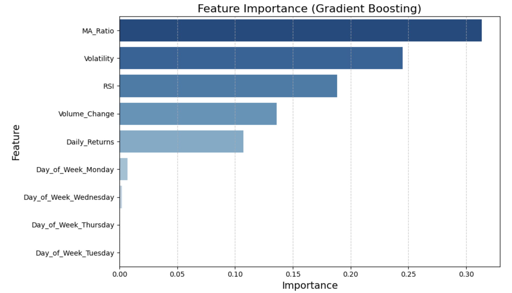
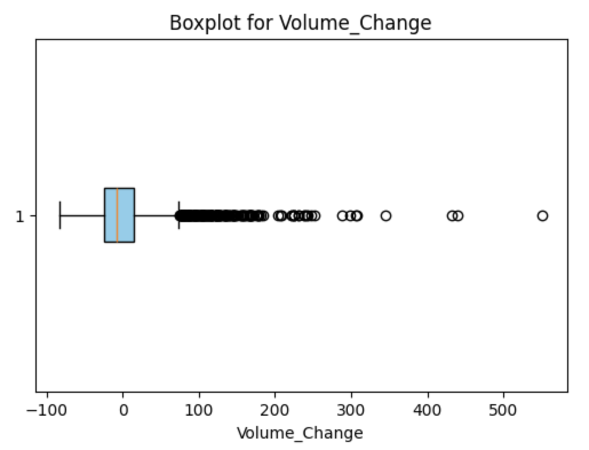
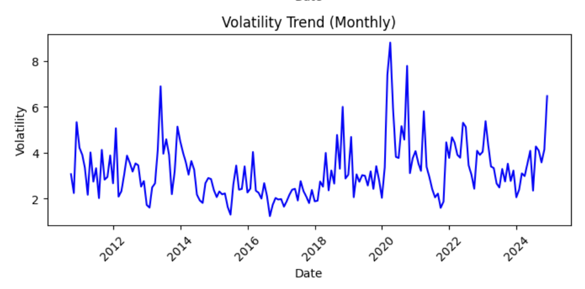

# Stock Market Signal Prediction

## Overview
This project explores whether machine learning can support better investment decisions by predicting short-term stock price movements. By analyzing over 14 years of Tesla (TSLA) daily stock data, we developed a binary classifier to identify "Up Opportunities" — days when stock returns are likely to exceed a predefined threshold. The ultimate goal is to support retail investors in improving market timing strategies and managing downside risk.

Prepared by: Vy Nguyen, Dennis Wu, Kenjee Koh, Hsiang-Han Huang, Becky Wang

Key results include:
- Gradient Boosting model achieved 59.03% accuracy on unseen data (random split)
- Final model showed 36% precision for Class 1 (up opportunities), supporting better downside risk control
- Feature importance analysis revealed MA Ratio, Volatility, and RSI as top predictors
- A scenario simulation projected a 393% annual return under specific trading assumptions

> **Strategic Insight:** In volatile markets, avoiding poor trades can be more valuable than aggressively chasing gains. Our model prioritizes conservative entry signals, helping investors identify when **not** to trade as much as when to trade.

---

## Dataset
- **Source:** yfinance Python library  
- **Scope:** 14+ years of Tesla (TSLA) daily data (2009–2023)  
- **Size:** 3,632 records (reduced to 3,577 after preprocessing)  
- **Target Variable:** Signal (1: future return exceeds a specified threshold, 0: otherwise)

### 📋 Data Dictionary

| Feature           | Definition                                                                 | Data Type     |
|-------------------|----------------------------------------------------------------------------|---------------|
| Daily_Returns     | % Daily change in stock price                                              | Continuous (%)|
| Volume_Change     | Change in volume as a % of the 10-day rolling average                      | Continuous (%)|
| Volatility        | Standard deviation of daily returns over a 10-day window                   | Continuous    |
| MA_Ratio          | Ratio of 10-day to 50-day moving averages on price                         | Continuous    |
| RSI (Relative Strength Index) | Measures the magnitude of price gains vs losses over 14-day window    | Continuous    |
| Day_of_Week       | Day extracted from date index, converted to dummy variables                | Categorical   |

---

## Tools & Methodology Overview
**Languages and Libraries:** Python (pandas, numpy, scikit-learn, matplotlib, seaborn)

### Data Processing:
- Downloaded historical TSLA data using `yfinance`
- Engineered 6 technical indicators: MA Ratio, RSI, Volatility, Volume Change, Price Trend, and Day of Week
- Created a binary target variable (`Signal`) to classify "Up Opportunity" days

### Exploratory Analysis:
- Analyzed class distribution (balanced: 44.8% Up vs 55.2% No Opportunity)
- Performed summary statistics and outlier checks
- Evaluated correlation and feature distributions

### Modeling Techniques:
- Trained Decision Tree, Random Forest, and Gradient Boosting models
- Applied RandomizedSearchCV and TimeSeriesSplit (5 folds) for hyperparameter tuning
- Tested two data-splitting strategies: random and chronological

### Evaluation Metrics:
- Accuracy, Precision, Recall, F1-Score (overall and class-specific)
- Feature importance analysis
- Investment scenario simulation based on prediction results

---

## Highlighted Visualizations

**Feature Importance:**

**Volume Change Boxplot:**

**Volatility Trend (Monthly):**

---

## Results & Key Insights

### Overall Model Performance

| Test Accuracy (%)           | Decision Tree | Random Forest | Gradient Boosting |
|----------------------------|---------------|----------------|-------------------|
| Random split               | 56.33         | 55.96          | **59.03**         |
| Random split + tuning      | **57.54**     | 57.26          | 58.84             |
| Chronological split        | 49.53         | 54.38          | 55.95             |
| Chronological + tuning     | 57.17         | 56.61          | 57.08             |

### Class 1 Accuracy (Up Opportunity)

| Class 1 Accuracy (%)       | Decision Tree | Random Forest | Gradient Boosting |
|----------------------------|---------------|----------------|-------------------|
| Random split               | 54            | 42             | **36**            |
| Random split + tuning      | 25            | **43**         | 36                |
| Chronological split        | **56**        | 44             | 43                |
| Chronological + tuning     | 16            | **52**         | 7                 |

- **Gradient Boosting** with random split gave the **highest overall test accuracy (59.03%)**
- However, **Random Forest** with chronological split + tuning achieved better **Class 1 detection** (52%)
- **Feature importance** revealed MA_Ratio, Volatility, and RSI as dominant predictors
- **Day-of-week** variable contributed little value
- Scenario simulation (targeting Class 1 days) suggested **strong upside potential with low risk exposure**
- Final model serves as a conservative signal generator: prefer **avoiding poor trades** over chasing risky wins

---

## Key Deliverables
- Jupyter Notebook: `Notebooks/Stock_Market_Signal_Prediction_Team_12B.ipynb`
- Final project report (PDF)
- Final project presentation (PDF)

---

## What I Learned
- Tree-based models can identify interpretable patterns in technical indicators but may not fully capture market dynamics
- The cost of false positives (bad trades) in finance is higher than missing opportunities — model precision matters more than recall
- Gradual improvements in model performance come from careful feature engineering and strategic evaluation design
- Classification of stock returns has limits — price direction alone doesn’t guarantee profit potential

---

## What I Plan to Improve
- Extend model to other stocks and broader asset classes
- Introduce economic indicators and sentiment-based signals (e.g., VIX, macro data, social sentiment)
- Test sequential models (e.g., LSTM, Temporal CNNs) that can capture price momentum and reversal patterns
- Simulate alternative trading strategies (e.g., risk-adjusted return, Sharpe ratio optimization)

---

## About Me
Hi, I’m Vy Nguyen and I’m currently pursuing my MS in Business Analytics at UC Irvine. I’m passionate about data analytics in Finance and Investment. Connect with me on [LinkedIn](https://www.linkedin.com/in/vy-ngoc-lan-nguyen).
